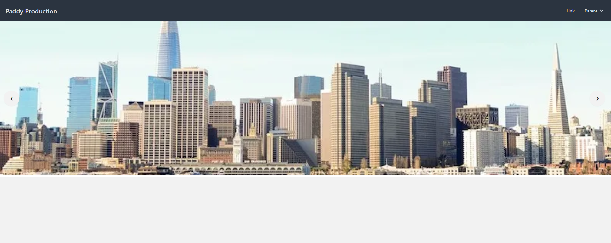
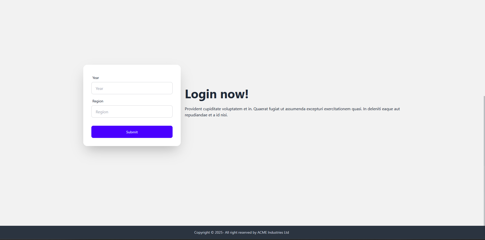
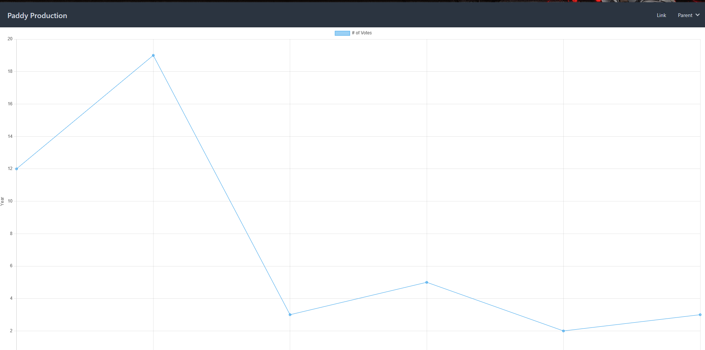
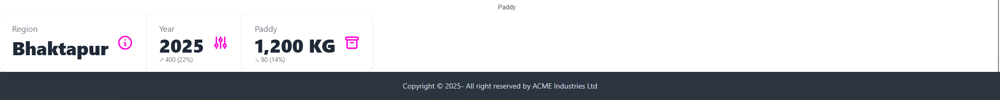

# Paddy_production

The frame work used is tailwind css with [Daisy UI](https://daisyui.com/) using CDN

## Home and caursel

## Form and Footer

## Dashboard Chart

## Result

### To view, go to https://surzatine.github.io/Paddy_production/